# Diagramas de Flujo - Sistema OSM

Este documento contiene los diagramas de flujo detallados de los procesos principales del sistema OSM, mostrando las relaciones entre HTML, JavaScript, PHP APIs y las tablas de la base de datos PostgreSQL.

## Tabla de Contenidos

1. [Flujo de Autenticación](#1-flujo-de-autenticación)
2. [Flujo del Módulo de Capacitaciones](#2-flujo-del-módulo-de-capacitaciones)
3. [Flujo del Módulo de Administración](#3-flujo-del-módulo-de-administración)
4. [Flujo del Módulo Agronómico](#4-flujo-del-módulo-agronómico)
5. [Flujo de Gestión de Sesiones](#5-flujo-de-gestión-de-sesiones)

---

## 1. Flujo de Autenticación

### Diagrama Mermaid

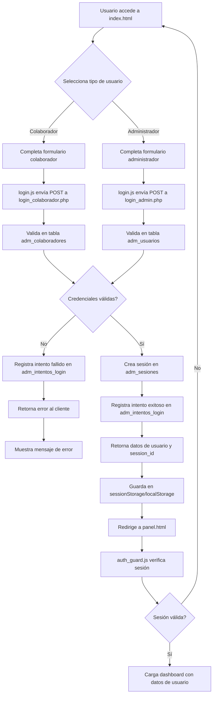

### Dependencias HTML → Database

**index.html** (Login)
- ↓ `assets/js/login.js`
- ↓ `php/login_colaborador.php` O `php/login_admin.php`
- ↓ **Tablas:**
  - `adm_colaboradores` (SELECT WHERE cedula AND password)
  - `adm_usuarios` (SELECT WHERE cedula AND password)
  - `adm_sesiones` (INSERT nueva sesión)
  - `adm_intentos_login` (INSERT intento)
  - `adm_roles` (JOIN para obtener permisos)

**panel.html** (Dashboard)
- ↓ `assets/js/auth_guard.js`
- ↓ `php/verificar_sesion.php`
- ↓ **Tablas:**
  - `adm_sesiones` (SELECT WHERE session_id AND activa=true)

---

## 2. Flujo del Módulo de Capacitaciones

### 2.1 Registro de Nueva Capacitación

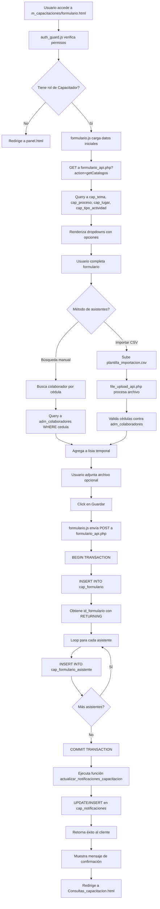

### Dependencias HTML → Database (Formulario de Capacitación)

**m_capacitaciones/formulario.html**
- ↓ `assets/js/formulario.js`
- ↓ `assets/php/formulario_api.php`
- ↓ **Tablas:**
  - **SELECT (Catálogos):**
    - `cap_tema` (listado de temas)
    - `cap_proceso` (listado de procesos)
    - `cap_lugar` (listado de lugares)
    - `cap_tipo_actividad` (tipos de actividad)
    - `adm_usuarios` (capacitadores)
  - **SELECT (Búsqueda):**
    - `adm_colaboradores` (búsqueda de asistentes)
  - **INSERT:**
    - `cap_formulario` (nueva capacitación)
    - `cap_formulario_asistente` (cada asistente)
  - **UPDATE (Trigger automático):**
    - `cap_notificaciones` (actualización por función PL/pgSQL)

### 2.2 Programación de Capacitaciones

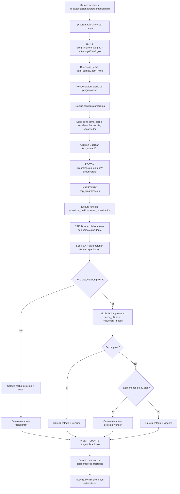

### Dependencias HTML → Database (Programación)

**m_capacitaciones/programacion.html**
- ↓ `assets/js/programacion.js`
- ↓ `assets/php/programacion_api.php`
- ↓ **Tablas:**
  - **SELECT:**
    - `cap_tema` (listado)
    - `adm_cargos` (listado)
    - `adm_roles` (capacitadores)
    - `cap_programacion` (programas existentes)
  - **INSERT:**
    - `cap_programacion` (nueva programación)
  - **UPDATE/INSERT (Función PL/pgSQL):**
    - `cap_notificaciones` (notificaciones automáticas)
  - **Query CTE en función:**
    - `adm_colaboradores` (colaboradores afectados)
    - `cap_formulario_asistente` (historial de asistencias)
    - `cap_formulario` (fechas de capacitaciones)

### 2.3 Consulta de Capacitaciones

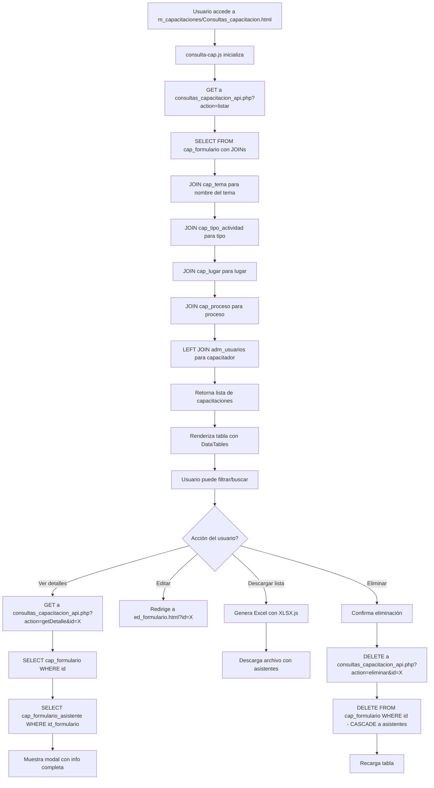

### Dependencias HTML → Database (Consultas)

**m_capacitaciones/Consultas_capacitacion.html**
- ↓ `assets/js/consulta-cap.js`
- ↓ `assets/php/consultas_capacitacion_api.php`
- ↓ **Tablas:**
  - **SELECT (Listado):**
    - `cap_formulario` (todas las capacitaciones)
    - `cap_tema` (JOIN)
    - `cap_tipo_actividad` (JOIN)
    - `cap_lugar` (JOIN)
    - `cap_proceso` (JOIN)
    - `adm_usuarios` (JOIN para capacitador)
  - **SELECT (Detalle):**
    - `cap_formulario` (WHERE id)
    - `cap_formulario_asistente` (WHERE id_formulario)
    - `adm_colaboradores` (JOIN para datos completos de asistentes)
  - **DELETE:**
    - `cap_formulario` (DELETE WHERE id - CASCADE automático a cap_formulario_asistente)

### 2.4 Sistema de Notificaciones

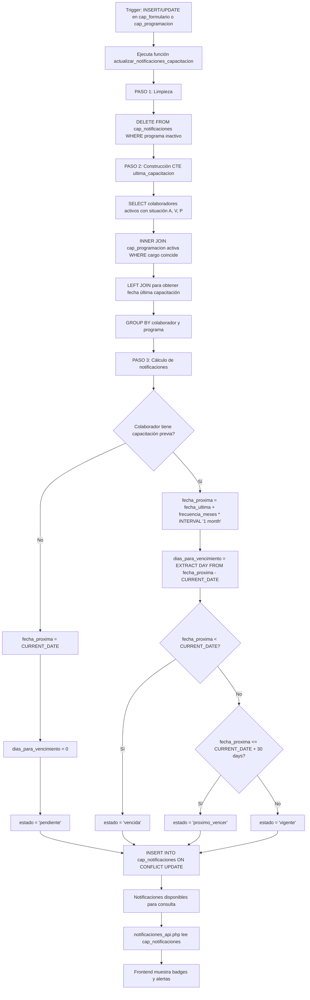

### Dependencias de Notificaciones

**Función PL/pgSQL: actualizar_notificaciones_capacitacion()**
- **Tablas involucradas:**
  - **DELETE FROM:**
    - `cap_notificaciones` (limpieza)
  - **SELECT (CTE):**
    - `adm_colaboradores` (colaboradores activos)
    - `cap_programacion` (programas activos)
    - `cap_formulario` (historial)
    - `cap_formulario_asistente` (asistencias)
  - **INSERT/UPDATE:**
    - `cap_notificaciones` (ON CONFLICT por constraint único)

**API de Notificaciones:**
- `assets/php/notificaciones_api.php`
- ↓ **Tablas:**
  - **SELECT:**
    - `cap_notificaciones` (WHERE id_colaborador)
    - `cap_programacion` (JOIN)
    - `cap_tema` (JOIN)
    - `adm_cargos` (JOIN)

---

## 3. Flujo del Módulo de Administración

### 3.1 Gestión de Usuarios Administradores

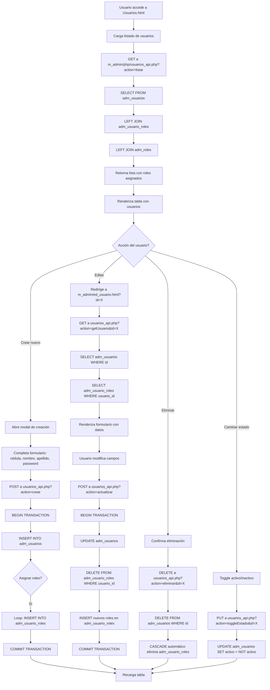

### Dependencias HTML → Database (Usuarios)

**Usuarios.html**
- ↓ `assets/js/usuarios.js`
- ↓ `m_admin/php/usuarios_api.php`
- ↓ **Tablas:**
  - **SELECT:**
    - `adm_usuarios` (listado)
    - `adm_usuario_roles` (JOIN)
    - `adm_roles` (JOIN)
  - **INSERT:**
    - `adm_usuarios` (nuevo usuario)
    - `adm_usuario_roles` (asignación de roles)
  - **UPDATE:**
    - `adm_usuarios` (modificación de datos)
  - **DELETE:**
    - `adm_usuarios` (eliminación - CASCADE a adm_usuario_roles)
    - `adm_usuario_roles` (al reasignar roles)

**m_admin/ed_usuario.html**
- ↓ `assets/js/usuarios.js`
- ↓ `m_admin/php/usuarios_api.php`
- ↓ **Tablas:** (mismas que arriba)

### 3.2 Gestión de Colaboradores

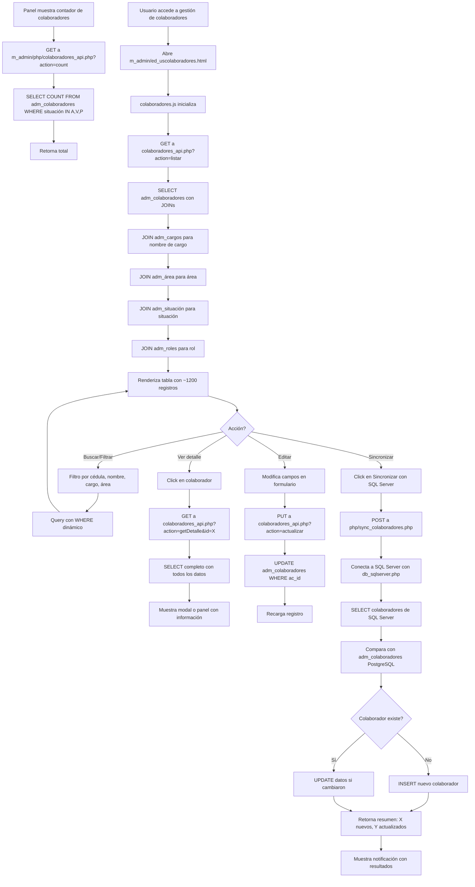

### Dependencias HTML → Database (Colaboradores)

**m_admin/ed_uscolaboradores.html**
- ↓ `assets/js/colaboradores.js`
- ↓ `m_admin/php/colaboradores_api.php`
- ↓ `php/sync_colaboradores.php` (sincronización)
- ↓ **Tablas PostgreSQL:**
  - **SELECT:**
    - `adm_colaboradores` (listado completo)
    - `adm_cargos` (JOIN)
    - `adm_área` (JOIN)
    - `adm_situación` (JOIN)
    - `adm_roles` (JOIN)
    - `adm_empresa` (JOIN)
  - **UPDATE:**
    - `adm_colaboradores` (modificación)
  - **INSERT (desde sincronización):**
    - `adm_colaboradores` (nuevos desde SQL Server)
- ↓ **Tablas SQL Server (lectura):**
  - Tabla de colaboradores externa (nombre variable según configuración)

---

## 4. Flujo del Módulo Agronómico

### 4.1 Programación de Fecha de Corte

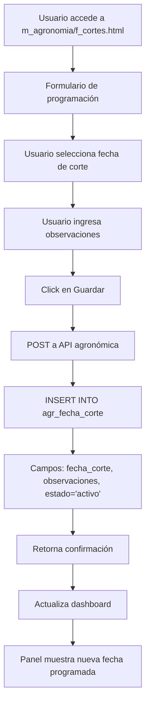

### 4.2 Monitoreo de Plagas (Ejemplo)

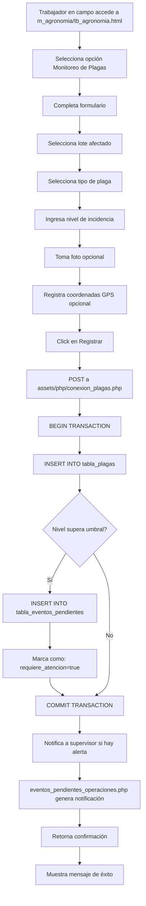

### 4.3 Aprobación de Monitoreos

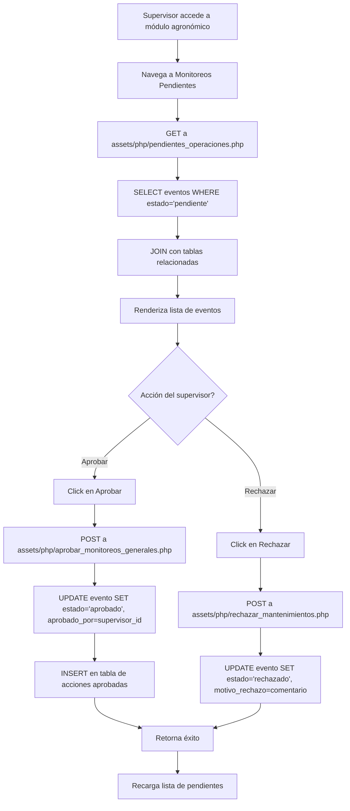

### Dependencias HTML → Database (Agronomía)

**m_agronomia/tb_agronomia.html**
- ↓ Múltiples scripts JS especializados
- ↓ Más de 50 archivos PHP API en `assets/php/`
- ↓ **Tablas** (estimadas, nombres varían):
  - `agr_plagas` (monitoreo de plagas)
  - `agr_enfermedades` (registro de enfermedades)
  - `agr_fertilizacion` (aplicaciones)
  - `agr_cosecha` (registro de RFF)
  - `agr_mantenimientos` (labores)
  - `agr_trampas` (monitoreo de trampas)
  - `agr_nivel_freatico` (control de agua)
  - `agr_eventos_pendientes` (eventos para aprobación)
  - `agr_lotes` (catálogo de lotes)
  - `adm_colaboradores` (JOIN para operadores)

**m_agronomia/f_cortes.html**
- ↓ Script JS específico
- ↓ API PHP específica
- ↓ **Tablas:**
  - `agr_fecha_corte` (INSERT/UPDATE/SELECT)

---

## 5. Flujo de Gestión de Sesiones

### 5.1 Verificación Continua de Sesión

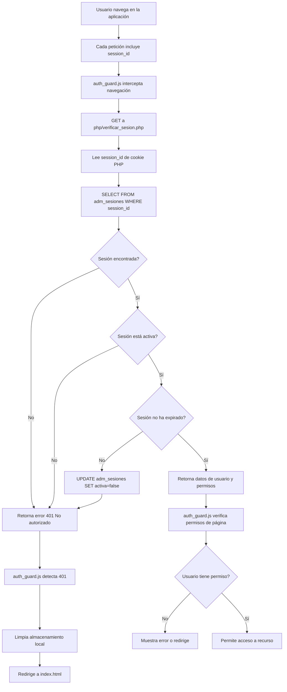

### 5.2 Gestión Activa de Sesiones

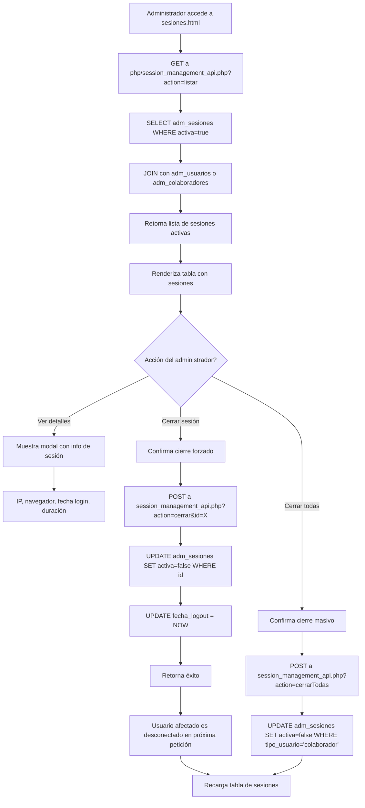

### 5.3 Cierre de Sesión por Usuario

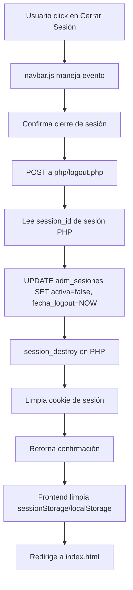

### Dependencias de Sesiones

**sesiones.html**
- ↓ `assets/js/sesiones.js`
- ↓ `php/session_management_api.php`
- ↓ **Tablas:**
  - **SELECT:**
    - `adm_sesiones` (WHERE activa=true)
    - `adm_usuarios` (LEFT JOIN)
    - `adm_colaboradores` (LEFT JOIN)
  - **UPDATE:**
    - `adm_sesiones` (cerrar sesión)

**Todas las páginas protegidas**
- ↓ `assets/js/auth_guard.js`
- ↓ `php/verificar_sesion.php`
- ↓ **Tablas:**
  - **SELECT:**
    - `adm_sesiones` (WHERE session_id AND activa=true)

**Logout**
- ↓ `php/logout.php`
- ↓ **Tablas:**
  - **UPDATE:**
    - `adm_sesiones` (SET activa=false, fecha_logout=NOW())

---

## Resumen de Tablas Más Utilizadas

### Top 10 Tablas por Operaciones

1. **adm_sesiones** - Verificada en cada petición
2. **adm_colaboradores** - Usada en autenticación, búsquedas, reportes
3. **cap_notificaciones** - Actualizada frecuentemente por función automática
4. **cap_formulario** - Core del módulo de capacitaciones
5. **cap_formulario_asistente** - Registros de asistencia masivos
6. **adm_usuarios** - Autenticación y gestión de administradores
7. **cap_programacion** - Consultas frecuentes para notificaciones
8. **adm_cargos** - JOIN frecuente en múltiples módulos
9. **cap_tema** - Catálogo usado en formularios y consultas
10. **adm_intentos_login** - Log de todos los intentos de acceso

---

## Notas de Implementación

### Optimizaciones Aplicadas

1. **Índices en tablas críticas:**
   - `idx_sesiones_session_id` en `adm_sesiones`
   - `idx_colaboradores_cedula` en `adm_colaboradores`
   - `idx_notif_colaborador` en `cap_notificaciones`
   - `idx_notif_estado` en `cap_notificaciones`

2. **Constraints para integridad:**
   - Foreign Keys con CASCADE DELETE donde aplica
   - Unique constraints en relaciones many-to-many
   - Check constraints en estados

3. **Triggers automáticos:**
   - `actualizar_notificaciones_capacitacion()` se ejecuta después de INSERT/UPDATE
   - `trigger_set_updated_at()` mantiene timestamps actualizados

4. **Transacciones:**
   - BEGIN/COMMIT en operaciones multi-tabla
   - ROLLBACK automático en caso de error

### Flujos Críticos para Rendimiento

1. **Verificación de sesión**: Optimizada con índice en session_id
2. **Búsqueda de colaboradores**: Índice en cédula para búsquedas rápidas
3. **Generación de notificaciones**: Función PL/pgSQL eficiente con CTEs
4. **Listado de capacitaciones**: JOINs indexados apropiadamente

---

**Última actualización**: 30 de Octubre de 2025
